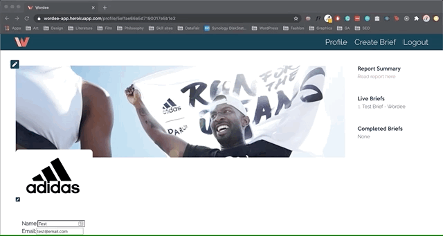
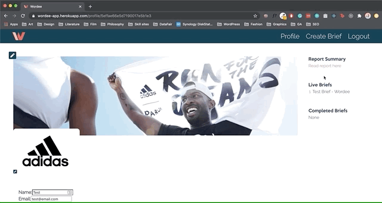
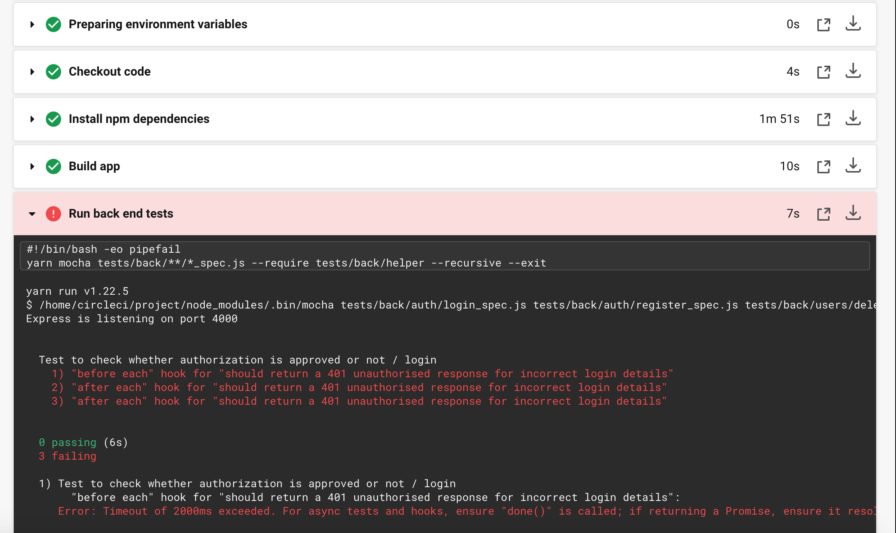

# 

<h1>Freelance Project: Wordee</h1>
 
<h2>Problem: Brands find the process of creating, and sending briefs to copywriters with up to date brand files slow and complicated.</h2>
 
<h2>Solution: Build a web app that allows a brand to manage all its files easily while streamlining the briefing process for copywriters.</h2>
 
| Contents                      |                                |
| ----------------------------- | ------------------------------ |
| 1. [Overview](#overview)      | 6. [Future content](#future)   |
| 2. [Brief](#brief)            | 7. [Wins](#wins)               |
| 3. [Technologies used](#tech) | 8. [Blockers](#blockers)       |
| 4. [App](#app)                | 9. [Bugs](#bugs)               |
| 5. [Approach](#approach)      | 10. [Future learnings](#learn) |
 
<h2 name='overview'>Overview</h2>
 
<h3>Introduction</h3>
 
I was approached by two colleagues with an idea to create a copywriting briefing tool for brands. It is now being tested by TRIP DRINKS. Wordee allows a brand to upload and update their information and files quickly and easily. It also provides a comprehensive briefing form to make it quick and easy to create a brief. The brand can easily edit and delete all information and briefs. From an admin panel, I and my colleagues can upload keyword searches for brands to access, while also downloading briefs and brand files to send to freelance copywriters.
 
<h3>Deployment</h3>
 
The app is deployed on Heroku and can be found here: https://wordee-app.herokuapp.com  
The login details are email: test@email password: pass  
 
<h2 name='brief'>Brief</h2>
 
- **Build a briefing tool** Create a web app that allows a brand to create, edit and delete brand information and briefs
- **Must have an admin panel** Admins must be able to download briefs and brand files
- **Writers must be access files** use external hosting for files and images
- **Have a simple design**
- **Be deployed online**
 
<h2 name='tech'>Technologies used and why?</h2>
 
I used <strong>GraphQL</strong> to reduce the amount of work the server had to do to reduce latency. 
I used <strong>Heroku</strong> because it comes ready to use with very little configuration compared to AWS. If the project scales, I will change to AWS due to price concerns. 
I used <strong>Firebox</strong> because like Heroku its a quick and simple setup to manage files and allows others to access those files via URL. 
I used <strong>CircleCI</strong> because I wanted to know every branch was being tested. 
I used <strong>React</strong> because needed the brief form to be able to react and change quickly to the user’s inputs. 
 

1. HTML5  
2. SCSS & Bulma  
3. JavaScript (ES6)  
4. Redux  
5. GraphQL  
6. Mocha  
7. Chai  
8. Express  
9. React.js  
11. Node.js  
12. Axios  
13. Jest  
14. Insomnia  
15. Dotenv  
16. Cloudinary  
17. Firebox  
18. CircleCI  
19. JWT  
20. Yarn  
21. Heroku  
22. GitHub  

 
<h2 name='app'>App</h2>
 
The brand will log into the app will immediately be able to edit their supporting data that will be sent to copy writers along with their briefs.The brand will be sent a report summary it can access as soon as we have sent it. 
 
 

 
 
 
Creating a brief is made simple by asking the brand to fill out a set of questions my colleagues thought essentially to fully explain what is needed. The brief reacts to choices made adds or removes questions accordingly. 
 
 

 
 
 
The brand can easily edit the brief just by clicking on its list item. 
 
 

 
 
 
The brand can easily change or remove their information. 
 
 

 
 
 
On the backend my colleagues and I are able to view brands and their information and can easily edit report summarys, download briefs to excel, and view images and files. 
 
 

 
<h2 name='approach'>Approach</h2>
My approach was to always keep the user in mind when I made every decision, for instance, my first instinct was to make a profile page and an edit profile page. However, I believe this gave the experience needless friction for the user. Therefore these pages could be combined for easy and fast manipulation. This ended making my code more simple too.
 
 
<h2 name='future'>Future content</h2>
<h3>A writers portal</h3>
We were discussing creating a writers portal and profile and I have some code commented out in the login component should we build this. However, we don't currently see any use for this 
 
 
<h3>Email alert system</h3>
We would like to be alerted by email if a user updates their information or edits a brief so we could send the new data to any writers who need it. 
 
 
<h2 name='wins'>Wins</h2>
<h3>Tested by TRIP DRINKS</h3>
[TRIP DRINKS](https://www.drink-trip.com/) Tested our app and found it very useful saying it was functional and well designed. TRIP is still using it and we are arranging user testing.
 
 
<h3>GaphQL</h3>
 
 
 
<h3>Redux</h3>
 
 
 
<h3>Design</h3>
I'm personally very happy with the design, I think it looks good and is easy to use. Getting feedback from users like TRIP saying "it's functional and well designed"
 
 
<h2 name='blockers'>Blockers</h2>
<h3>COVID-19</h3>
Due to the pandemic we are having to pause development due to this being a side project for my colleagues.
 
 
<h3>CircleCI</h3>
I seem to behaving trouble getting the backend up and therefore test it in CircleCI. I have emailed them asking for support.
 
 

 
 
 
<h2 name='bugs'>Bugs</h2>
<h3>Brand images</h3>
Sometimes when uploading brand images the images may not appear on the brand profile until the page is reloaded. I checked to see if the getData function was waiting until the upload to the backend had been completed and it was. 
 
 
<h2 name='learn'>Future learnings</h2>
• Use TypeScript to better avoid bugs like merging objects and arrays. 
• Use Storybook to test UI components. 
